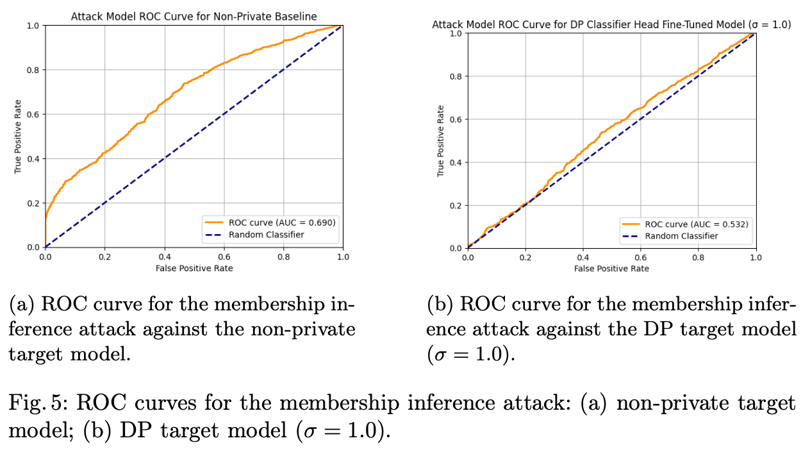

# Differentially Private Fine-Tuning of Self-Supervised Learning Models for Human Activity Recognition on Wearables

## Abstract
The surge in wearable technology for health has advanced personalized Human Activity Recognition (HAR), yet introduces privacy concerns under EU regulations such as the GDPR, the AI Act and the European Health Data Space (EHDS). This study examines fine-tuning approaches for self-supervised models on wearable data, using Differentially Private Stochastic Gradient Descent (DP-SGD) to balance privacy and utility. Using the PAMAP2 dataset and the HarNet10 model, we compare classifier head and full model fine-tuning. Our results show that tuning only the classifier head (4.83% of parameters) preserves higher accuracy and F1-scores while significantly reducing vulnerability to membership inference attacks compared to non-private baselines. This strategy provides a lightweight and regulation-compliant framework for privacy-preserving HAR on wearables.




## Overview
This repository contains Colab-ready notebooks for two experiments that fine-tune a self-supervised foundation model (HarNet10) on the PAMAP2 wearable HAR dataset, with and without Differentially Private SGD (DP-SGD), and then evaluate robustness to Membership Inference Attacks (MIA).

- **Experiment 1 (Privacy–Utility Trade-off)**: Fine-tune models on the datasets (DP vs. non-DP) and compare performance.  
- **Experiment 2 (Empirical Privacy)**: Fine-tune models on the datasets, save them, generate predictions, and run membership inference attacks.

**Dataset:** We use the publicly available PAMAP2 Physical Activity Monitoring dataset from the UCI Machine Learning Repository (DOI: 10.24432/C5NW2H).

**Foundation Model:** We adapt HarNet10, a self-supervised ResNet-V2–based foundation model pre-trained on 700k person-days of wrist accelerometer data, as described by Yuan et al., 2024.

All notebooks are designed to run seamlessly on **Google Colab**.

---

## Google Colab Setup

1. **Mount your Google Drive**  
   Be sure to update the path to where you’ve stored this project in your Drive.
   ```python
   from google.colab import drive
   import os

   drive.mount('/content/drive')
   active_directory = '/content/drive/MyDrive/Desktop/DP_Finetuning_Harnet'
   os.chdir(active_directory)
   ```
---

## Folder Structure
```
DP_Finetuning_Harnet/
├── Protocol/
│ └── raw_subject_data/ # original data from subjects
├── attack_results_DP/ # DP-fine-tuned target models
│ └── final_models/
├── attack_results_noDP/ # non-private fine-tuned target models
│ └── final_models/
├── downsampled_results_DP/ # Experiment 1 evaluation outputs (DP)
├── downsampled_results_noDP/ # Experiment 1 evaluation outputs (noDP)
├── imgs/ # The figures based on the results
├── Experiment1_Finetuning_DP.ipynb # DP fine-tuning
├── Experiment1_Finetuning_noDP.ipynb # noDP fine-tuning
├── Experiment1_Analysis.ipynb # Experiment 1 eval & plots
├── Experiment2_Model_Saving.ipynb # Train & save DP/noDP models
├── Experiment2_Predictions.ipynb # Load models & generate preds
└── Experiment2_Attack_Results.ipynb # Shadow models + membership inference
```

**NOTE:** To run with the existing models it is sufficient to work with 'Experiment1_Analysis.ipynb', 'Experiment2_Model_Saving.ipynb' and 'Experiment2_Attack_Results.ipynb'.


## Experiment 1: Comparison of Fine-tuning Strategies
- **Experiment1_Finetuning_DP.ipynb**
    1. Fine-tune models with Differential Privacy using Classifier Head Fine-Tuning and Full Model Fine-Tuning.
        * Output → Reports saved under downsampled_results_DP/.

- **Experiment1_Finetuning_noDP.ipynb**
    1. Fine-tune non-private models using Classifier Head Fine-Tuning and Full Model Fine-Tuning.
        * Output → Reports saved under downsampled_results_noDP/.

- **Experiment1_Analysis.ipynb**
    1. Load results, compute evaluation metrics, and generate comparative plots for Experiment 1.

## Experiment 2: Empirical Analysis of the Target Models Against Membership Inference Attacks
- **Experiment2_Model_Saving.ipynb**
    1. Fine-tune (DP\[σ=1\] or non-DP)  and save target models to:
        * attack_results_DP/final_models/
        * attack_results_noDP/final_models/

- **Experiment2_Predictions.ipynb**
    1. Load saved target models, run inference on test data, and get predictions.

- **Experiment2_Attack_Results.ipynb** 
    Perform Membership Inference Attacks:
    1. Train shadow models
    2. Train an attack model
    3. Evaluate attack accuracy on DP vs. non-DP target models
    Output → Metrics and plots saved in respective attack_results_* directories.

## References

```bibtex
@misc{reiss2012pamap2,
  author       = {Reiss, Attila},
  title        = {{PAMAP2 Physical Activity Monitoring}},
  year         = {2012},
  howpublished = {UCI Machine Learning Repository},
  note         = {{DOI}: https://doi.org/10.24432/C5NW2H}
}
```

```bibtex
@article{yuan2024self,
  title={Self-supervised learning for human activity recognition using 700,000 person-days of wearable data},
  author={Yuan, Hang and Chan, Shing and Creagh, Andrew P and Tong, Catherine and Acquah, Aidan and Clifton, David A and Doherty, Aiden},
  journal={NPJ Digital Medicine},
  volume={7},
  number={1},
  pages={91},
  year={2024},
  publisher={Nature Publishing Group UK London}
}
```